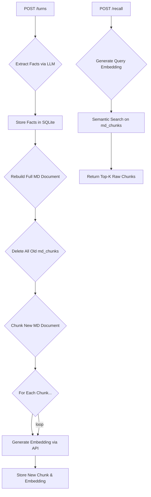

# Memory Service Architecture

This document outlines two architectures:
1.  **The Current Alpha Architecture (v1.2.1):** What is currently implemented. It is functional but contains critical performance and recall quality issues.
2.  **The Proposed "Excellent" Architecture:** A production-ready design that addresses the alpha's flaws and meets the "Excellent" criteria from the project specification.

---

## 1. Current Alpha Architecture (v1.2.1)

This version works but suffers from a major performance bottleneck, making it unsuitable for production.

### Architecture Flow



### Key Characteristics & Flaws

1.  **Backing Store:** SQLite.
2.  **Extraction Pipeline:** An LLM extracts structured facts on every turn.
3.  **Recall Strategy:** Vanilla cosine similarity search.
4.  **Critical Flaw - Write Amplification:** The most significant issue is that on **every single `POST /turns` request**, the service re-calculates, deletes, and re-embeds the *entire user history*. This is incredibly slow and expensive. A user with 100 memories would trigger 10+ embedding API calls on every new message they send.
5.  **Critical Flaw - Sub-par Recall:** The recall pipeline is a "vanilla cosine-top-k" approach, which is explicitly called out in the project brief as being insufficient. It will fail on keyword-sensitive queries and multi-hop questions.

---

## 2. Proposed "Excellent" Architecture (Future Work)

This architecture is designed for high performance, excellent recall quality, and cost-effectiveness. It directly addresses the "Hard Problems" outlined in the project specification.

### Architecture Flow

```mermaid
graph TD
    subgraph "On /turns (Fast & Incremental)"
        A[POST /turns] --> B{Extract New Facts};
        B --> C[Generate New MD Document (in memory)];
        C --> D{Diff New Chunks vs. Old Chunks in DB};
        D --> E{Identify New/Modified/Deleted Chunks};
        E --> F[For each New/Modified Chunk...];
        F --> G[Generate Embedding];
        G --> H[Insert or Update Chunk in DB];
        E --> I[Delete Obsolete Chunks];
    end

    subgraph "On /recall (Hybrid Search & Reranking)"
        J[POST /recall] --> K{Generate Query Embedding};
        K --> L[BM25 Search (Keyword)];
        K --> M[Semantic Search (Vector)];
        L & M --> N{Reciprocal Rank Fusion (RRF)};
        N --> O{LLM Reranker};
        O --> P[Final Top-K Chunks];
        P --> Q{Assemble Context w/ Budgeting};
        Q --> R[Return Context & Citations];
    end
```

### Key Improvements & Justifications

1.  **Incremental Embeddings (Fast Writes):**
    *   **What:** On `/turns`, we generate the new MD document in memory and "diff" it against the chunks stored in the database. We only generate embeddings for **new or modified chunks** and delete any that are no longer present.
    *   **Why:** This reduces the number of embedding API calls from `N` (total chunks) to `1-2` per turn, making the `/turns` endpoint nearly instantaneous and dramatically reducing operational costs.

2.  **Hybrid Search with RRF (Excellent Recall):**
    *   **What:** On `/recall`, we perform two searches in parallel: a BM25 search for keyword relevance and a semantic search for meaning. The results are combined using Reciprocal Rank Fusion (RRF) to produce a single, superior ranking.
    *   **Why:** This directly addresses the requirement for a non-vanilla recall pipeline. It balances keyword and semantic relevance, allowing the system to answer both "What is the dog's name?" (keyword) and "What are the user's career goals?" (semantic).

3.  **LLM Reranker (Precision for Complex Queries):**
    *   **What:** The top ~10 results from the RRF phase are passed to a lightweight LLM call to perform a final re-ranking based on the specific query.
    *   **Why:** This is the key to solving multi-hop questions. The reranker can identify the 2-3 chunks that, when combined, answer a complex query like "In what city does the user with the dog named Biscuit live?".

4.  **Context Assembly Under Budget:**
    *   **What:** Before returning the final context, the service will classify the reranked chunks (e.g., `stable_fact`, `temporal_memory`) and assemble the `context` string according to the specified priority: stable facts > query-relevant memories > recent conversation.
    *   **Why:** This fulfills a core requirement of the project brief and demonstrates thoughtful context engineering.
