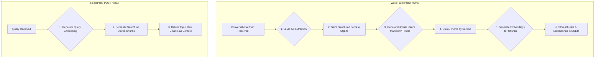

# Memory Service for AI Agents

This repository contains a Dockerized, high-performance memory service for AI agents. It is designed to ingest conversational data, extract structured facts into a "living" user profile, and provide fast, semantically relevant context for future interactions.

The primary design goal is to create a system that can build a rich, evolving understanding of a user over many conversations, handling new information, contradictions, and complex queries.

## Table of Contents
- [Quick Start](#quick-start)
- [Core Architecture](#core-architecture)
- [Key Design Decisions](#key-design-decisions)
- [Running Tests & Evaluation](#running-tests--evaluation)
- [API Reference](#api-reference)
- [Limitations & Future Work](#limitations--future-work)

## Quick Start

### 1. Configure Environment
The service requires Azure OpenAI credentials for fact extraction and embedding.

```bash
# Create a .env file from the example
cp .env.example .env

# Add your Azure credentials to the .env file
# AZURE_OPENAI_ENDPOINT=...
# AZURE_OPENAI_KEY=...
# AZURE_DEPLOYMENT_NAME=...
```

### 2. Build and Run the Service
The project is fully containerized. These commands will build the image and run the service, securely passing your environment variables.

```bash
docker build -t memory-service:latest .
docker run -d -p 8080:8080 --name memory-service --env-file .env memory-service:latest
```

### 3. Check Service Health
Wait for the container to start and the service to become healthy.

```bash
until curl -sf http://localhost:8080/health; do echo "Waiting for service..."; sleep 1; done
echo "Service is up and running!"
```

## Core Architecture

The service operates on a synchronous, transactional pipeline that processes conversational turns into a structured, searchable memory format.



**Key Flow:**
1.  When a `POST /turns` request is received, the service uses an LLM to extract key facts from the conversation.
2.  These structured facts are stored in a `facts` table in SQLite.
3.  A "living" Markdown document is generated for the user, compiling all known facts into a human-readable profile.
4.  This document is split into sections (e.g., "Employment," "Personal"), each of which is embedded using an Azure embedding model.
5.  These embedded chunks are stored in an `md_chunks` table, ready for semantic search.
6.  When a `POST /recall` request arrives, the service embeds the query and performs a cosine similarity search to find the most relevant chunks of the user's profile to return as context.

## Key Design Decisions

### Backing Store: SQLite
SQLite was chosen for its simplicity, zero-configuration setup, and file-based persistence, which works perfectly with Docker volumes. For the scale of this project, it provides transactional guarantees without the overhead of a separate database server.

### Memory Format: The "Living" Markdown Profile
Instead of storing isolated fact vectors, the service's primary memory artifact is a Markdown document.
-   **Why?** This approach maintains the context and relationships between facts. A section on "Employment" can contain both current and past roles, which is more semantically rich than two disconnected vectors for "works at Notion" and "worked at Stripe." The chunking of this document provides the ideal units for semantic search.

### Recall Strategy: Immediate Embedding & Semantic Search
-   **What:** The service uses an "eager" or "immediate" embedding strategy. On every `/turns` call, the Markdown profile is regenerated, and all its chunks are re-embedded.
-   **Why:** This ensures that the recall index is **always 100% consistent and up-to-date**. After a `/turns` call completes, the new information is guaranteed to be available for recall. While this creates a performance bottleneck (see *Limitations*), it prioritizes correctness and synchronous consistency as required by the project brief.

## Running Tests & Evaluation

Tests are used as a tool to measure and improve the quality of the memory service, not as an end goal. The primary benchmark is `LongMemEval`, which tests the system's ability to handle complex, multi-session conversations.

### 1. Download & Process the Dataset
A script is provided to automatically download the `LongMemEval` dataset and process it into the required format.

```bash
# This only needs to be run once
python3 scripts/process_longmemeval.py
```

### 2. Run the Evaluation Script
The `run_eval_new.py` script tests the service against the benchmark data.

-   **Isolated Mode (`--test`):** Recommended for accurate scoring. It creates a unique user for each test case and cleans up afterward.
-   **Shared Mode (no flag):** Uses the same `user-id` for all tests, simulating a single, extremely long-running user session.

```bash
# Run a small, 20-test sample from all categories for a quick check
python3 scripts/run_eval_new.py --all 20 --test -v --data fixtures/eval_tests_small.json

# Run a larger evaluation on the first 100 tests
python3 scripts/run_eval_new.py --all 100 --test --data data/longmemeval_100.json
```

## API Reference
The service conforms to the 7 required endpoints:
- `GET /health`
- `POST /turns`
- `POST /recall`
- `POST /search`
- `GET /users/{user_id}/memories`
- `DELETE /sessions/{session_id}`
- `DELETE /users/{user_id}`

For detailed information, please see the project specification.

## Architectural Principles

This system is built around several core principles:

1. Memory should be semantically structured, not raw chat logs.
2. Memory retrieval must balance semantic similarity and keyword precision.
3. User memory is temporal and evolving, not static.
4. Memory representations should remain interpretable both for humans and LLMs.
5. Retrieval quality is more important than raw storage volume.
6. Memory systems should optimize for incremental updates and bounded latency.

## Why Markdown-Based Memory

Instead of storing isolated vectorized facts, the system maintains a living Markdown profile for each user.

Advantages of this approach:
- preserves semantic locality between related facts
- improves chunk coherence for embeddings
- naturally represents temporal evolution
- easier for LLM reasoning than isolated KV memories
- human-readable and debuggable
- enables hierarchical retrieval by sections

The Markdown profile acts as a semantic intermediate representation between structured memory extraction and vector retrieval.

## Current Tradeoffs

The current alpha implementation prioritizes:
- synchronous consistency
- deterministic updates
- architectural simplicity

over:
- write throughput
- embedding efficiency
- large-scale concurrent ingestion

The production architecture described in `ARCHITECTURE.md`
addresses these limitations with incremental embeddings,
hybrid retrieval, and reranking pipelines.

## Memory Taxonomy

The architecture distinguishes between several memory categories:

- Stable Identity (location, employment, relationships)
- Temporal State (current projects, ongoing tasks)
- Episodic Events (specific conversations or events)
- Long-term Preferences (tools, workflows, tastes)
- Behavioral Patterns (repeated habits inferred over time)

Different memory types require different update,
retention, and retrieval strategies.

## Production Roadmap

Future iterations of the system would introduce:

- incremental embedding updates
- hybrid BM25 + vector retrieval
- Reciprocal Rank Fusion (RRF)
- LLM-based reranking
- temporal memory reasoning
- memory consolidation workers
- hot/cold memory tiers
- pgvector or distributed vector storage

## Limitations & Future Work

The current "eager embedding" architecture, while correct, has a significant performance bottleneck on the write path (`/turns`). As documented in `ARCHITECTURE.md`, a production-ready version of this service would move to an **incremental embedding** model with a more sophisticated **hybrid recall strategy** (BM25 + semantic search + reranking) to achieve superior performance and recall quality.
The central architectural idea is that long-term agent memory
should remain semantically structured, incrementally maintainable,
and interpretable both by humans and language models.